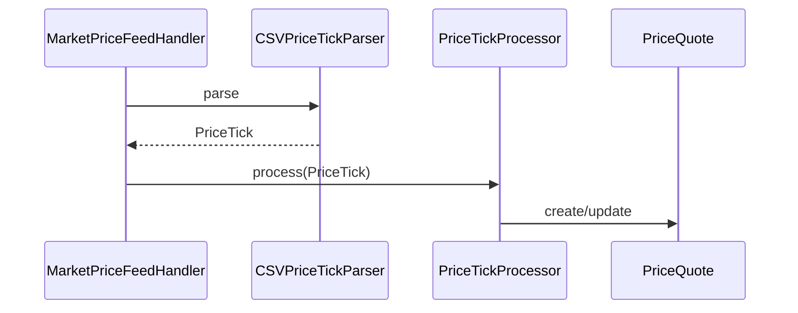
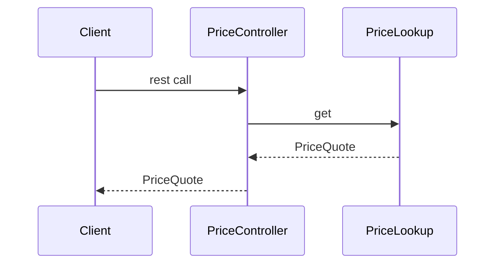

# Building

```
% git clone https://github.com/amitdawle/marketpricehandler.git
% cd marketpricehandler 
% ./gradlew clean build
.....
BUILD SUCCESSFUL in 2s
5 actionable tasks: 4 executed, 1 up-to-date
```

# Design guide

### Architecture
The microservice is designed on the principles of [onion/clean architecture](https://jeffreypalermo.com/2008/07/the-onion-architecture-part-1/).
The package structure reflects the application layout. A simple hashmap in PriceCache maintains the latest price.

The service does not use spring for di but can be easily retrofitted to do so.
Spring boot is also not included (but can be added) to serve the rest endpoints.

### Flow
* MarketPriceFeedHandler handles the incoming messages.
* It uses a parser to parse and convert the message to a PriceTick and the uses PriceTickProcessor to process the tick.
* Clients of the rest api are served by the PriceController which uses a PriceLookup to lookup to lookup and send the price.
* If no price is found it sends an empty string (with REST it would send a 404)

## Feed processing



## Instrument Lookup



### Building and Running the code
I have built application using Idea 2022.1 CE edition, gradle 7.4.
There are tests for the api and the individual components. The org.santander.marketpricehandler.Demo
class shows a (mock) setup on how the service will run 

### Assumptions / Limitations
* The code has no synchronization. With multiple thread are reading writing simultaneously, there is a possibility of data race/visibility issues. For that the map in the org.santander.marketpricehandler.core.api.PriceCache can be changed to
a concurrent map or (my preferred approach) is to have a shim/indirection layer that handles thread pinning/actor
or any other synchronization.

* The argument checks are very basic.
  
* Error handling is limited.

* There is no logging/sysout.


### REST API
Please note the demo will not run any server based on the requirement
`
Publish the adjusted price to REST endpoint (just show where the endpoint will be, do not need to implement a webserver).
`

**It is easy to enable that and I can update the application if required so.**


The endpoint would be host:port/markethandler/fxprices/{instrumentId}. An example would be 
`
 host:port/marketpricehandler/fxprices/GBPEUR
`
This should return a json (with spring boot) but currently returns just a string (no http headers).


